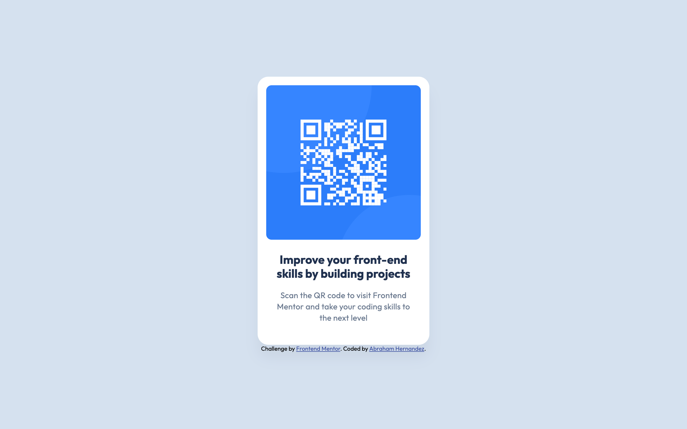

# Frontend Mentor - QR code component solution

This is a solution to the [QR code component challenge on Frontend Mentor](https://www.frontendmentor.io/challenges/qr-code-component-iux_sIO_H). Frontend Mentor challenges help you improve your coding skills by building realistic projects.

## Table of contents

- [Overview](#overview)
  - [Screenshot](#screenshot)
  - [Links](#links)
- [My process](#my-process)
  - [Built with](#built-with)
  - [What I learned](#what-i-learned)
  - [Continued development](#continued-development)
  - [AI Collaboration](#ai-collaboration)
- [Author](#author)

## Overview

### Screenshot



### Links

- Solution URL: [Add solution URL here](https://your-solution-url.com)
- Live Site URL: [Add live site URL here](https://your-live-site-url.com)

## My process

### Built with

- Semantic HTML5 markup
- CSS custom properties
- Flexbox
- Mobile-first workflow

### What I learned

I learned about how to import Fonts from Google Fonts and select the desired weights

```html
<link rel="preconnect" href="https://fonts.googleapis.com" />
<link rel="preconnect" href="https://fonts.gstatic.com" crossorigin />
<link
  href="https://fonts.googleapis.com/css2?family=Outfit:wght@400;700&display=swap"
  rel="stylesheet"
/>
```

I learned why I had to use align-self: stretch in CSS: it causes the element to occupy the entire available space in its container, rather than just its own size. This was necessary for text-align: center to center the heading across the full width of the card, not just across its text.

```css
h1 {
  align-self: stretch;
}
```

### Continued development

I would like to continue learning about design tokens, as I feel I need a deeper understanding to work with them more efficiently in the future. I also want to improve my UX/UI skills, since this is an area where improvement comes mainly through practice. Finally, I would like to learn more about accessibility, given its importance in the development of websites and web applications.

### AI Collaboration

At this stage, as I am still developing my web development foundations, I am using AI as a tutor to guide me through the process. We begin by discussing what I want to build, and the AI then asks me questions about project decisions, such as which HTML tag to use when creating the page. We then discuss why one option might be preferable to others. Finally, the AI explains the reasoning behind each decision so that I can better understand both what I am doing and why.

- #### What tools did you use (e.g., ChatGPT, Claude, GitHub Copilot)?

  Claude Code

- #### How did you use them (e.g., debugging, generating boilerplate, brainstorming solutions)?

  I used it primarily as a mentoring tool

- #### What worked well? What didn't?
  What worked well was the process of reasoning through concepts I hadn't considered before, such as align-self: stretch — instead of being given the code directly, I was guided to think it through, build my own version, and then review what was right or wrong to correct it until reaching the desired result. For this particular challenge, I didn't run into any notable friction with this approach.

## Author

- Website - [Abraham Hernandez](https://github.com/javierhrzgt)
- Frontend Mentor - [@javierhrzgt](https://www.frontendmentor.io/profile/javierhrzgt)
- Twitter - [@javierhrzgt](https://www.twitter.com/javierhrzgt)
